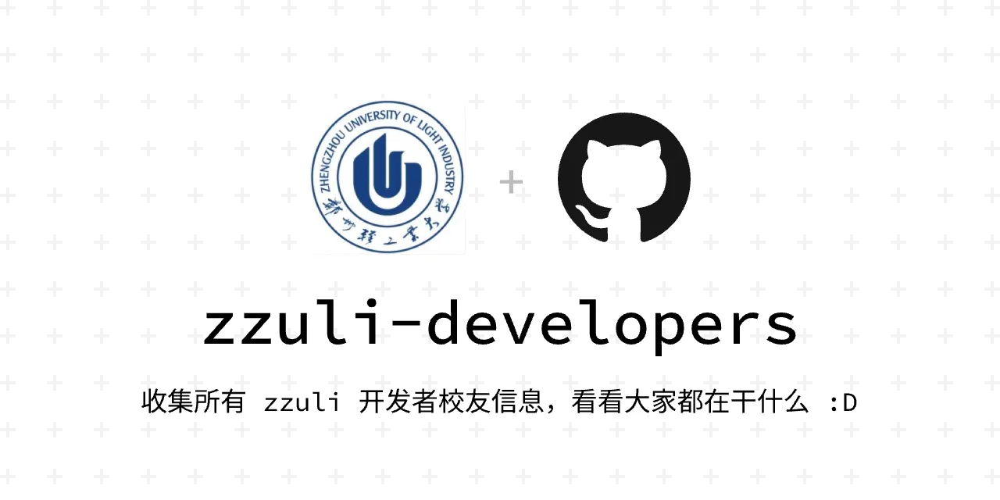

## zzuli-developers

<picture>
  <source media="(prefers-color-scheme: dark)" srcset="./banner/banner-dark.webp">
  <source media="(prefers-color-scheme: light)" srcset="./banner/banner-light.webp">
  
</picture>

收集所有 zzuli 开发者校友信息，看看大家都在干什么 :D

## 项目列表

## 校友大合集

> 暂时只记录25年有 commit 记录或有学校相关项目，通过搜集筛选获得，可能不准确 = =

---

| 昵称          | GitHub                                                | 博客/主页                                      |
| ------------- | ----------------------------------------------------- | ---------------------------------------------- |
| 十有\*\*      | [billionray](https://github.com/billionray)           |                                                |
| 空梦          | [EmptyDreams](https://github.com/EmptyDreams)         | [山岳库博](https://kmar.top/)                  |
| 绫袅LingNc    | [LingNc](https://github.com/LingNc)                   |                                                |
| 雨奇晴好      | [xwwwb](https://github.com/xwwwb)                     |                                                |
| ShiYi         | [ShiYioo](https://github.com/ShiYioo)                 | [Shi Yi の 小库](https://blog.shiyio.uk/)      |
| SkySummer     | [SkySummer](https://github.com/SkySummer)             |                                                |
| 探姬          | [ProbiusOfficial](https://github.com/ProbiusOfficial) | [Hello CTF](https://hello-ctf.com/)            |
| Caiki         | [Cai-ki](https://github.com/Cai-ki)                   |                                                |
| Frex          | [FrexCheat](https://github.com/FrexCheat)             |                                                |
| RaXianch      | [DeSireFire](https://github.com/DeSireFire)           |                                                |
| Sleepwf       | [Games55k](https://github.com/Games55k)               |                                                |
| vow           | [vow0328](https://github.com/vow0328)                 |                                                |
| Dang Wenliang | [fookwood](https://github.com/fookwood)               | [闷瓜蛋子](https://fookwood.com/)              |
| GlassSky01    | [GlassSky01](https://github.com/GlassSky01)           |                                                |
| Dogxi         | [dogxii](https://github.com/dogxii)                   | [狗窝子](https://blog.dogxi.me/)               |
| 冬酒暖阳      | [HanZephyr](https://github.com/HanZephyr)             |                                                |
| Zhang Yi-Ze   | [Chivas-Regal](https://github.com/Chivas-Regal)       | [Tech Blog](https://tech.chivas-regal.top/)    |
| suspen        | [suspenss](https://github.com/suspenss)               |                                                |
| polter        | [555TT](https://github.com/555TT)                     |                                                |
| Su Yiheng     | [827652549](https://github.com/827652549)             | [苏一恒](https://827652549.github.io/)         |
| Juntao Han    | [mstao](https://github.com/mstao)                     | [明月逐人归](https://www.cnblogs.com/mingshan) |
| LFAboy        | [LFAboy](https://github.com/LFAboy)                   |                                                |
| Meteor_Z      | [Meteor-Z](https://github.com/Meteor-Z)               | [Meteor-Z](https://liuzechen.top/)             |
| 123508        | [123508](https://github.com/123508)                   |                                                |
| hoey          | [hoey94](https://github.com/hoey94)                   | [Hoey](https://www.yihao.de/)                  |
| Benign X      | [W-Mai](https://github.com/W-Mai)                     | [B3n1gn X](https://benign.host/)               |
| z1zhang       | [z1zhang](https://github.com/z1zhang)                 |                                                |

---

目前先用文字表格，后面再用图文卡片形式。（再加上针对活跃度的脚本排序）

收集中 ...

## 快速添加

- 可以直接修改 README.md 在表格后新起一行并提交 pr

- 或fork本项目并在本地运行 `node add.js` 进行快速添加

## 相关信息

- 如果你正在校学习，欢迎来通过issue或pr提交自己以及自己的项目！

- 如果收集了您的信息，但是不希望出现在本项目，可以通过私发邮箱 hi@dogxi.me 联系删除，非常抱歉！

## 灵感来源

[chinese-independent-developer](https://github.com/1c7/chinese-independent-developer)
